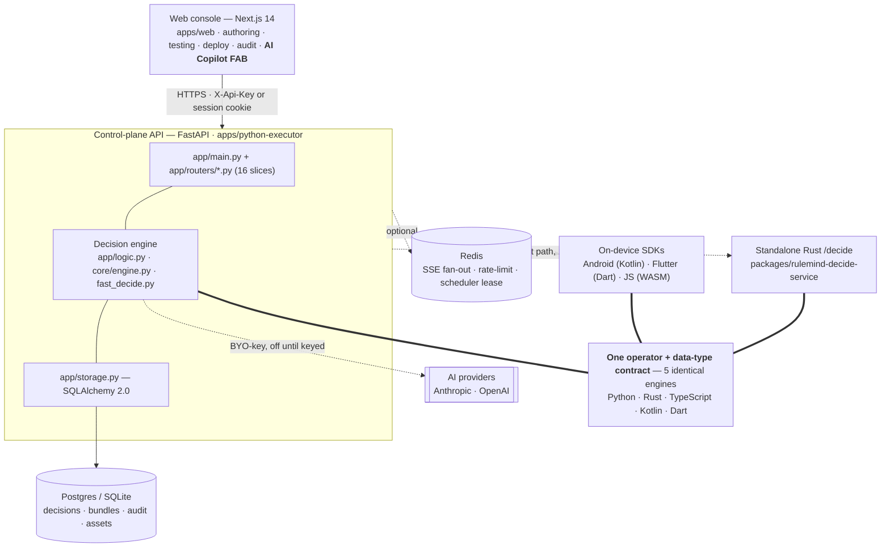
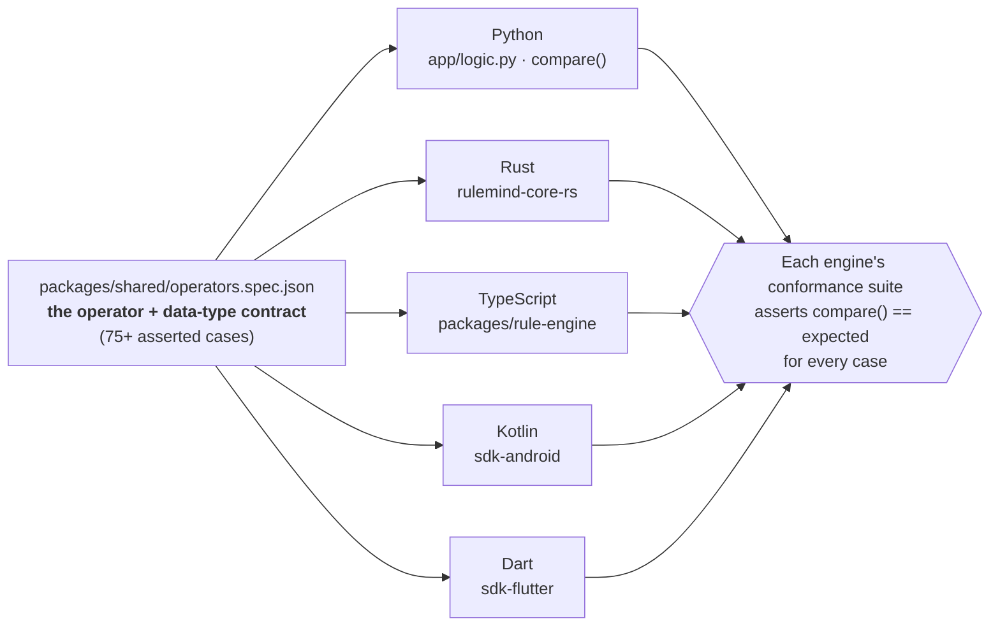
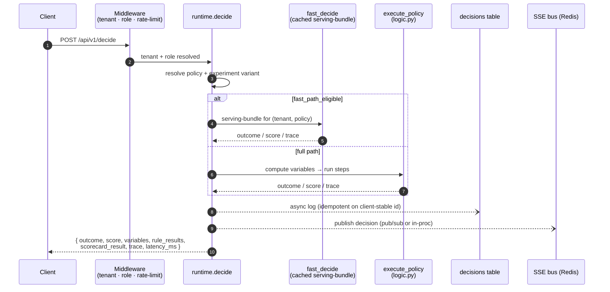
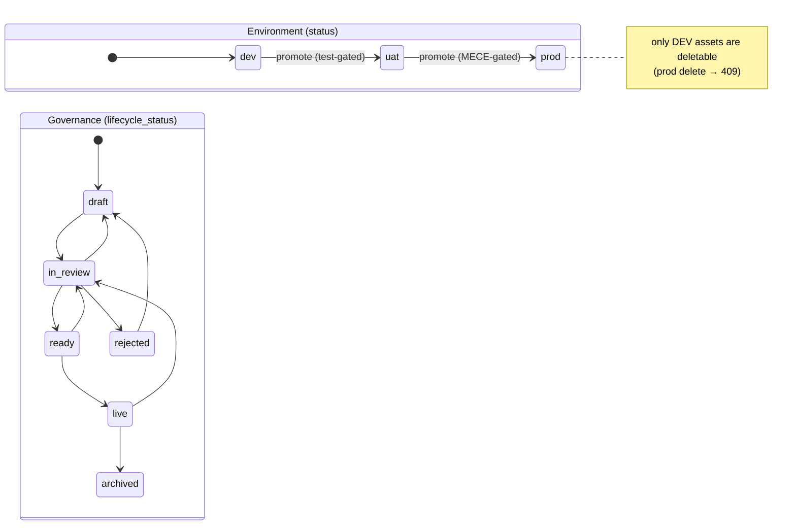
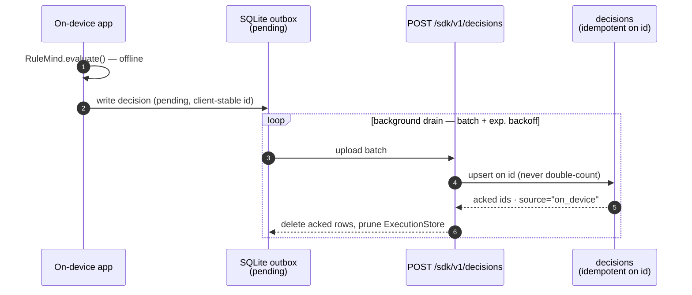
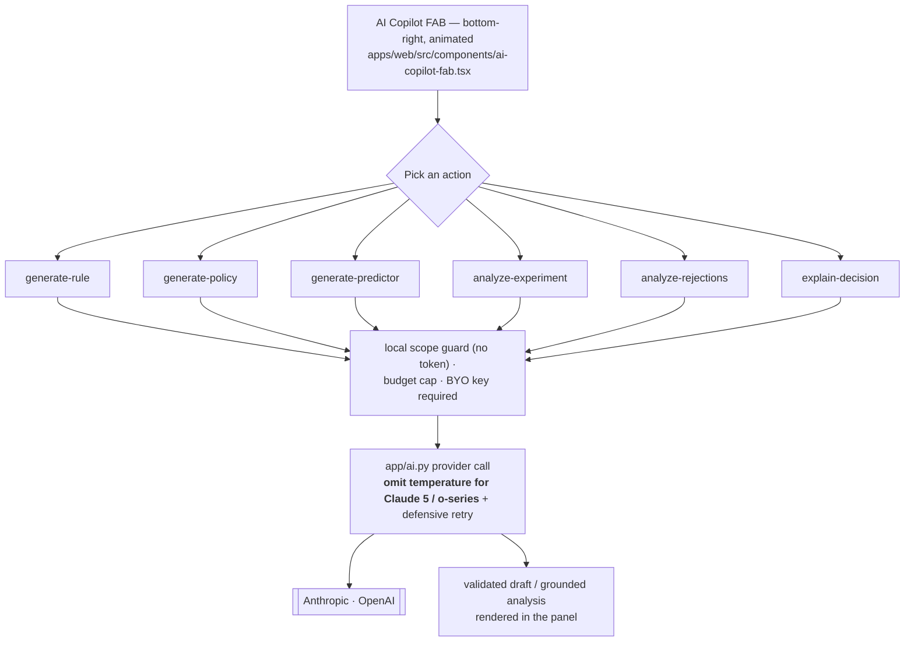

# RuleMind.AI — High-Level Design (HLD)

> A use-case-agnostic **decision platform**: author variables, rules, scorecards, and policies
> visually; test and promote them through environments; then execute decisions at scale over an API,
> on a workflow engine, or **on-device** via signed bundles. This document explains every feature,
> its runtime flow, and the exact files/tables (data pointers) that implement it.

- **Audience:** engineers and reviewers who need the full mental model without reading 30k lines.
- **Convention:** _data pointers_ are given as `path` and `table`/`function` names so any claim here is
  checkable in one hop.
- **Not lending-specific.** The seeded demo happens to use bureau/DTI variables, but every concept
  (connector, variable, rule, scorecard, policy) is generic over arbitrary JSON payloads.

---

## 1. System at a glance

ASCII fallback of the same picture is preserved in git history; every box maps to a file/table named in §17.

**Component summary**

| Layer | Tech | Location |
|---|---|---|
| Web console | Next.js 14 (App Router), React, Zustand | `apps/web` |
| Control-plane API | FastAPI, SQLAlchemy 2.0, Uvicorn | `apps/python-executor/app` |
| Persistence | Postgres (prod default) / SQLite (dev), WAL | `app/models.py`, `app/db.py` |
| Cache / bus | Redis (optional) — SSE, rate limit, scheduler lease | `app/decision_bus.py` |
| Native engines | Rust (PyO3 + WASM), Kotlin, Dart | `packages/rulemind-core-rs`, `packages/sdk-android`, `packages/sdk-flutter` |
| Standalone decide svc | Rust HTTP (`/decide`, 1000+ TPS target) | `packages/rulemind-decide-service` |
| Cross-engine specs | JSON conformance fixtures | `packages/shared/*.spec.json` |

---

## 2. Core domain model

Everything an author builds is one of five asset types, all **tenant-scoped**, all **versioned**, and
all carrying an environment `status` (`dev` → `uat` → `prod`). Definitions: `apps/python-executor/app/models.py`.

| Asset | Purpose | Table / model | Key columns |
|---|---|---|---|
| **Connector** | A named data source + JSON schema + sample payload | `connectors` | `schema_fields`, `sample_payload`, `encrypted_config`, `is_active` |
| **Variable** | A sandboxed Python feature computed from one connector's payload | `variables` | `code`, `source_id`, `category`, `status`, `last_test_result` |
| **Rule** | A boolean decision tree over variables (12 operators, AND/OR/NOT) | `rules` | `rule_format` (v1/v2), `nodes`, `tree`, `expression` |
| **Scorecard** | Points assigned to variable ranges → a numeric score | `scorecards` | `base_score`, `max_score`, `bins` |
| **Policy** | An ordered pipeline of steps (rules, scorecards, models, actions…) → an outcome | `policies` | `steps`, `trigger`, `default_outcome`, `status`, `lifecycle_status` |

**Two orthogonal state axes on a policy:**
- `status` — the **environment** it's promoted to (`dev`/`uat`/`prod`).
- `lifecycle_status` — the **governance stage** (`draft` → `in_review` → `ready` → `live`, plus
  `rejected`/`archived`). See `app/lifecycle.py`; endpoints `GET/POST /api/v1/policies/{id}/lifecycle`.

**Version history:** every mutation snapshots into `entity_histories` (`EntityHistory`), surfaced at
`GET /api/v1/variables/{id}/history` etc.

**Multi-tenancy:** every row has `tenant_id`; the request's tenant is resolved once in middleware and
read live by routers via `main.active_tenant_id(request)` (from `request.state.tenant_id`).

---

## 3. Request lifecycle, auth & multi-tenancy

**File:** `app/middleware.py` (`TenantContextMiddleware`, a `BaseHTTPMiddleware`).

Every request flows through, in order:
1. **CORS / health bypass** — health, metrics, docs skip auth.
2. **mTLS (optional, config-gated)** — `app/mtls.py` verifies a client cert fingerprint; sets
   `request.state.mtls_*`. Off by default.
3. **`AUTH_MODE=none`** — early-return for local/dev and the test harness.
4. **Credential resolution** — either `X-Api-Key` (→ `storage.get_tenant_by_api_key`) **or**
   `Authorization: Bearer <session>` (a human member session). Both resolve to **tenant + RBAC role**.
5. **Tenant active check** + **rate limiting** (`rate_limit_allow`, plan-based: 5000 enterprise /
   1000 standard req/window; **fail-closed in production**).
6. Sets `request.state.tenant_id / role / actor_kind / session_id / api_key_id`.

**Auth building blocks** (`app/auth.py`): API keys (`generate_api_key`, `key_lookup_hash`,
`mask_api_key`, per-key role), bcrypt for member passwords, admin JWT (`create_admin_jwt`), member
session tokens (hashed at rest), OTP (`generate_otp_code`, hashed), HMAC webhook signatures.

**Human auth surfaces** (`app/routers/identity.py`, `onboarding.py`, `platform.py`):
- Workspace login / logout / session — `POST /api/v1/auth/login`, `/logout`, `GET /auth/session`.
- **OTP** — `/auth/otp/request`, `/auth/otp/verify`.
- **SSO** — SAML ACS + OIDC callback (`/auth/sso/saml/acs`, `/auth/sso/oidc/callback`,
  `/auth/sso/available`, `/auth/sso/start`); config `app/sso.py`, per-tenant at `PUT /access/sso`.
- **Platform admin** (cross-tenant) — `/api/admin/v1/*`: tenants CRUD, per-tenant API keys.
- **Mobile auth** — `/api/mobile/v1/*`: demo/login + tenant session for the sample apps.

**RBAC** (`app/rbac.py`): roles **owner/admin, policy-maker, reviewer, viewer**; members and roles at
`/api/v1/access/members`, `/access/roles`, `/access/keys`. Session cookies are httpOnly + CSRF
(`app/session_cookie.py`), keeping tokens out of `localStorage`.

---

## 4. The decision engine (the heart)

The same evaluation semantics are implemented in **five engines** and pinned by a single conformance
spec so the server, the Rust fast path, the browser preview, and the on-device SDKs never diverge.

**Reference engine:** `app/logic.py`. **The five conforming engines:** Python (`app/logic.py`), Rust
(`rulemind-core-rs`), TypeScript (`packages/rule-engine`, the web preview), Kotlin (`sdk-android`), Dart
(`sdk-flutter`).

- **Operators (12), one authority** — `compare()` (`logic.py:215`): `== != > >= < <= between in not_in
  exists !exists regex boolean`. Missing variable → `None` → comparisons return `False` (mirrored in
  every engine after the missing-var parity fix).
- **Data-type contract (per `fieldType`)** — the corpus pins exactly how each type compares, identically
  in all five engines:
  - **number** — ordered ops (`> >= < <= between`) coerce both sides to number; a non-numeric operand →
    `false`. No lexical string ordering anywhere (a divergence that was closed: the TS engine used to
    lexically order strings).
  - **date** — a **first-class type**: both operands normalize to a **UTC epoch** via a strict ISO-8601
    regex + integer civil-days math (Howard Hinnant), *not* each platform's native date parser (they
    disagree on leniency/timezone). So dates genuinely **order** (`applicationDate > "2026-01-01"`) and
    equality is **spelling-insensitive** (`"2026-01-01" == "2026-1-1"`); an unparseable value → `false`.
  - **boolean** — `==`/`!=` on coerced booleans.
  - **equality (`==`/`!=`)** is **loose / numeric-aware** in every engine, so a numeric string equals its
    number (`"750" == 750`) — Python previously used strict `==` and diverged; now unified.
- **Rule trees** — `evaluate_rule_tree()` (`logic.py:281`) walks an AND/OR/NOT tree with a recursion
  **depth guard**; v1 flat `nodes` are normalized via `nodes_to_tree` / `flatten_tree_to_nodes`. v2
  rules carry an explicit `tree` (preserved verbatim by the compiler).
- **Scorecards** — `evaluate_scorecard()` (`logic.py:382`): sum points for matched bins, clamp to
  `[base_score, max_score]`.
- **Policy pipeline** — `execute_policy()` (`logic.py:520`): resolve connector payloads → compute
  variables → run each step (rule/scorecard/model/branch/action…) → merge into a final `outcome` +
  `score` + full `trace`.

**Structured decision core:** `app/core/engine.py` — `decide()` (`engine.py:183`) is the clean,
DB-free entry (input validation via `validate_input`, experiment resolution, `DecisionResult`), reused
by the Lambda adapter (`app/core/lambda_handler.py`) and service wrapper (`app/core/service.py`).

**Native parity:**
- Rust: `packages/rulemind-core-rs/src/lib.rs` (+ `variables.rs`), exposed to Python via **PyO3** and
  to web/SDK via **WASM**; conformance in `tests/conformance.rs` (benchmarked 575k+ decisions/s/core).
- Kotlin: `packages/sdk-android/.../RuleEvaluator.kt`, `ScorecardEvaluator.kt`, `PolicyExecutor.kt`.
- Dart: `packages/sdk-flutter/lib/src/rule_evaluator.dart`, `scorecard_evaluator.dart`,
  `policy_executor.dart`.
- Cross-engine truth: `packages/shared/operators.spec.json`, `decision-tables.spec.json`,
  `large-policy.spec.json` (≥500 conditions / ≥700 variables, incl. missing-var cases).

---

## 5. Decision execution flows

### 5.1 Synchronous `/decide` (hot path)
`POST /api/v1/decide` (router `app/routers/runtime.py`).

- **Fast path** (`app/fast_decide.py`): `fast_path_eligible()` gates it; `_serving_bundle()` caches a
  compiled bundle keyed by tenant+policy; `invalidate()` clears it on any asset change. Enabled with
  `FAST_DECIDE=1`. `is_fast_servable()` + the fast/full conformance test guarantee identical output to
  the full path (single eligibility authority).
- **Decision logging** is async by default (non-blocking write to `decisions`), which is why the
  decision-log integrity test asserts exactly-once under concurrency.
- **Standalone scale:** `packages/rulemind-decide-service` (Rust) serves a dedicated `/decide` for
  1000+ TPS, reading the same bundle format.

### 5.2 Batch & streaming
- `POST /api/v1/decide/batch` — array in, array out.
- `POST /api/v1/decide/batch/jsonl` — line-delimited streaming for large simulations.
- `GET /api/v1/decisions/stream` — **SSE live feed**; fan-out via Redis pub/sub when available
  (`app/decision_bus.py`: `publish_decision`, `channel_for`, `compact_frame`), else in-process.
- `POST /api/v1/decisions/{id}/replay` — re-run a historical decision against a chosen bundle version
  to see if today's logic would decide differently.

### 5.3 Testing surfaces (pre-promotion)
Each asset has a test endpoint that runs against the active sample payloads:
`/test/variables`, `/test/rule/{id}`, `/test/policy/{id}`, `/test/action`, `/test/batch`,
`/variables/{id}/test`, `/rules/{id}/test`, `/scorecards/{id}/test`, plus `/variables/test-draft` for
unsaved code. (Several carry **stacked routes** — e.g. `/policies/{id}/execute` == `/test/policy/{id}`.)

---

## 6. Authoring domain (build → test → promote)

**Routers:** `authoring.py` (connectors, variables, scorecards), `rules.py`, `policies.py`.

- **Connectors** — CRUD + `POST /connectors/{id}/test` (validate a sample payload against the schema).
  Secrets live in `encrypted_config` (Fernet), never returned to the client.
- **Variables** — Python snippets executed in a **sandbox** (`app/sandbox.py`) over a single
  connector's payload; dependency graph at `GET /variables/graph` (`variable_graph`); category buckets
  (Bureau/Banking/Business/Device/Identity/Custom are just demo defaults).
- **Rules** — visual click-to-add builder; both v1 (`nodes`) and v2 (`tree`) formats; server generates
  the human-readable `expression` (`generate_rule_expression`). Compilation for the fast path/bundle:
  `app/compiler.py` (`compile_variable`, `_compile_expr` → register-based instructions).
- **Scorecards** — bins map variable ranges → points; live sample preview.
- **Policies** — order connectors→variables→rules→scorecards→(models/actions/branches) into a full
  flow; `GET /policies/{id}/input-schema` returns the union of required connector fields.

**Two orthogonal state machines** — the deployment **environment** (`status`) and the governance
**lifecycle** (`lifecycle_status`) — move independently:

**Promotion & environments** (`app/routers/operations.py`, `policies.py`):
- `POST /{asset}/{id}/promote` and `POST /api/v1/deploy/promote` move an asset `dev`→`uat`→`prod`,
  **test-gated** (and **MECE-gated** for multi-rule policies). Every promotion writes a `promotions` row
  with a **snapshot** of the definition; reaching `prod` compiles the serving bundle.
- `POST /api/v1/policies/{id}/lifecycle` walks the governance stages above (`app/lifecycle.py`,
  `can_transition`).
- `GET /api/v1/deploy/status` — matrix of what's promoted where.
- `GET /api/v1/policies/{id}/diff` (`app/policy_diff.py`) — structural diff between the current draft
  and the last live snapshot, shown before approving a promotion.
- **Delete guard:** only `dev` assets are deletable (a prod/uat delete returns `409` — demote first).

---

## 7. Workflow engine (multi-step, sync + async, human-in-the-loop)

A policy's `steps` can go beyond pure evaluation into an **orchestration graph**. Engine files:
`app/executor.py`, `app/runtime.py`, `app/reviews.py`, `app/scheduler.py`, `app/worker.py`.

- **Step types:** rule, scorecard, model, **branch** (conditional routing), **http_request** (call an
  external API — Postman-style, logged to `action_logs`), **sub-workflow**, **loop** (with a debug
  endpoint `POST /api/v1/workflows/loop-debug`), and **manual review**.
- **State:** long-running executions persist in `workflow_executions` (`context`,
  `current_step_index`, `status` running/paused/completed). Async pauses resume via
  `POST /api/v1/executions/{id}/resume` or `/workflows/{id}/callback`.
- **Human-in-the-loop:** a review step mints a `review_tasks` row (queue, required fields, timeout);
  reviewers act at `/api/v1/reviews`, `/reviews/{id}/decide`, `/reviews/{id}/escalate`, with
  `/reviews/stats`.
- **Triggers:** direct API, **webhooks** (`webhooks` table, HMAC-verified, `POST /webhooks/{id}`), and
  **cron schedules** (`cron_schedules`, `POST /schedules`, `/schedules/{id}/run-now`,
  `/schedules/{id}/history`).
- **Multi-replica safety:** the scheduler uses a **leader-election lease** (`scheduler_lease` table) so
  only one replica fires a given schedule.

---

## 8. Bundles & on-device SDKs (offline decisions)

**Goal:** ship the entire prod decision logic to a mobile client and decide **offline**, identically to
the server.

**Compile & serve** (`app/compiler.py`, router `app/routers/sdk.py`):
- `render_bundle_response()` produces a bundle that is **signed** (`_sign_payload`, RSA) and optionally
  **encrypted** to a client public key (`_encrypt_bundle_payload`). Persisted in `bundles`
  (`content`, `encrypted_content`, `signature`, `checksum`, `version`, `expires_at`, `superseded`).
- SDK endpoints: `GET /sdk/v1/bundle`, `/sdk/v1/blocks/{policy_id}` (embeddable decision block),
  `/sdk/v1/experience-manifest`, `/sdk/v1/health`, `POST /sdk/v1/decide`.

**On-device engines:** `packages/sdk-android` (Kotlin) and `packages/sdk-flutter` (Dart) each carry the
full evaluator, scorecard, policy executor, decision-table evaluator, experiment manager, and a
**decision cache**. Bundle verification checks signature + checksum before use.

**Durable decision sync (at-least-once, dedupe):**

- On-device outbox in SQLite — `DecisionOutbox.kt` / `sqflite_decision_outbox.dart` (with in-memory
  fallbacks) — writes each decision `pending`, drains in **batches** with exponential backoff.
- Upload: `POST /sdk/v1/decisions` (batch) / `/sdk/v1/executions/sync`. Backend ingest is **idempotent
  on a client-stable `id`** (`Decision.id`), so retries **never double-count**; server tags
  `source="on_device"`. `DecisionSyncer` / `sync_service.dart` orchestrate; `ExecutionStore` is pruned
  after ack.
- SDK telemetry: `POST /sdk/v1/events` → `sdk_events` (analytics at `GET /api/v1/analytics/sdk`).

---

## 9. Experiments — A/B & champion/challenger

**Router:** `app/routers/experiments.py`; logic `app/experiments.py`, `app/champion_challenger.py`.

- Define variants with traffic weights and a deterministic **hash key** (default `user_id`) so a given
  subject is stably bucketed. `experiments` table (`variants`, `hash_key`, `target_policy_id`,
  start/end).
- Lifecycle: `POST /experiments`, `PATCH /experiments/{id}/status`, `POST /experiments/{id}/promote`
  (promote the winning variant to the live policy).
- At decide time, `core/engine.py::_resolve_experiment` picks the variant and stamps
  `experiment_id` / `experiment_variant` onto the `decisions` row.
- Results/analytics aggregate over the **full window** (not a trailing sample):
  `GET /experiments/{id}/results`, `GET /api/v1/analytics/experiments/{id}`.

---

## 10. Decision tables & MECE analysis

**Router endpoints** under `/api/v1/decision-tables` (CRUD + `analyze`, `{id}/analyze`,
`{id}/evaluate`); logic `app/decision_tables.py`, `app/mece.py`; conformance
`packages/shared/decision-tables.spec.json`.

- A decision table is a compact condition-matrix → outcome mapping, evaluable on the fast path and
  on-device (`DecisionTableEvaluator` in both SDKs).
- **Optimiser / MECE analyzer** flags **overlapping** and **unreachable** rows and gaps
  (mutually-exclusive-collectively-exhaustive checks). Also exposed for whole policies:
  `POST /api/v1/policies/{id}/analyze-mece`. The web surfaces an "unreachable row" note.

---

## 11. Reports & analytics

**Router:** `app/routers/reports.py`, `app/routers/insights.py`; logic `app/reports.py`,
`app/analytics.py`.

- **Report builder** (`report_definitions`): dynamic columns + filters + timezone over the decision
  log. `POST /reports/preview`, `/reports`, `PUT/DELETE`, `/reports/{id}/run`, `/reports/{id}/run` →
  `export.csv`, `column-suggestions`.
- **Scheduled email delivery:** `schedule` on the report + `POST /reports/{id}/send`; delivery is
  durable via an **email outbox** (`email_outbox` table, `app/mailer.py`, retried with backoff).
  Config at `GET/PUT /reports/email-config`.
- **Analytics/insights:** `GET /analytics/decisions`, `/analytics/latency`, `/analytics/sdk`,
  `POST /analytics/rejection-drivers` (top contributing conditions), backtesting
  `POST /policies/{id}/backtest` (`app/backtest.py`).
- **Full outcome spectrum:** `rejection_drivers()` (`app/analytics.py`) partitions the *whole* spectrum,
  not just declines — `focus_count` counts **reject + review** (never **approve**), and a driver's
  `fail_count` is attributed only to focused decisions (a condition that "fails" on an approved decision
  contributes zero). This is the compute the AI **`analyze-rejections`** action interprets, and its
  no-declines skip. Pinned by `tests/test_outcome_spectrum.py`.

---

## 12. AI Copilot & hosted ML models

**AI router:** `app/routers/ai.py`; logic `app/ai.py`; workflow provider templates `app/providers.py`.
**BYO-key, server-side, provider-agnostic** (Anthropic + OpenAI). The key is Fernet-encrypted per tenant
and never touches the browser; a **local scope guard** refuses off-topic prompts *before* any paid call.

- **Six actions** — each guarded, budgeted, and returning a **draft/analysis that is never auto-applied**:
  - `POST /ai/generate-rule`, `/ai/generate-policy` — NL → a validated asset **draft** (still MECE/test-gated).
  - `POST /ai/generate-predictor` — a definition → a **draft scorecard** over existing variables; any bin
    referencing an unknown variable id marks the draft invalid.
  - `POST /ai/analyze-experiment` — reads a champion/challenger's **server-computed** results → a
    quantitative promote/hold/rollback call (the LLM interprets, never invents numbers).
  - `POST /ai/analyze-rejections` — server-computed decline/review drivers → why rejections changed +
    next steps; skips the LLM (no token) when there are no declines.
  - `POST /ai/explain-decision` — plain-English rationale + adverse-action reason codes for one `trace`.
- **Provider abstraction** (`app/ai.py`) — `_call_anthropic` / `_call_openai` behind a `_PROVIDERS` map;
  `complete()` + `extract_json()` + `AIError`. `temperature` is **omitted for models that reject it**
  (the Claude 5 family and OpenAI o-series 400 on it) with a defensive retry-without-temperature — caught
  by a live end-to-end run, since mock tests never build the real request body.
- **Frontend FAB** — a single floating action button (bottom-right, sparkle icon, pulse + "thinking"
  animation) mounts only when AI is enabled, and invokes every action from anywhere in the console.
- **Config & governance** — `GET/PUT /ai/config` (per-provider key, Fernet-encrypted in
  `settings.ai_config`, **masked on read**), live model list `GET /ai/models`, **cost/budget tracking**
  `GET /ai/usage`, `PUT /ai/budget`, `POST /ai/usage/reset`. AI is **off until a key is supplied**
  (feature-gated), and calls are async (`httpx`).

**Hosted models router:** `app/routers/models.py`; executor `app/model_executor.py`.
- Upload a pickled sklearn/xgboost model (`hosted_models` table, DB-persisted so it survives restarts
  and is consistent across workers). `POST /models`, `/models/{id}/predict`, `/models/{id}/test`.
- Used as a **`model` step** inside a policy pipeline, so ML scores compose with rules/scorecards.

---

## 13. Governance, security & compliance

**Router:** `app/routers/governance.py`; support in `app/observability.py`, `app/slo.py`,
`app/security_config.py`, `app/archiver.py`.

- **Audit trail** — every mutation/promotion/login writes `audit_events`; operational failures write
  `error_events`. Surfaces: `/audit/decisions`, `/audit/decisions/count`, `/audit/errors`,
  `/audit/promotions`.
- **PII & retention** — `settings.audit_retention_days`; data-protection controls at
  `GET/PUT /settings/data-protection`; decision payloads are **encrypted at rest**, and
  `redact_payload()` (`logic.py:581`) strips sensitive keys from previews. A pluggable **archiver**
  (ClickHouse / S3) offloads aged decisions.
- **SLO & drift** — per-tenant SLO config (`GET/PUT /settings/slo`, `/slo/status`) with
  outcome-drift alerting (`app/slo.py`).
- **Secure defaults** — **fail-closed in production** on default secrets and on rate-limit failure;
  optional **mTLS** client-cert verification (`app/mtls.py`); HMAC-verified webhooks; httpOnly cookie
  sessions + CSRF; the decision hot path avoids broad `except` swallowing (P3 sweep).

---

## 14. Onboarding

**Router:** `app/routers/onboarding.py`. A guided flow: `POST /onboarding/signup` → email
`/onboarding/verify` → `/onboarding/load-samples` (demo assets behind a flag) → `/onboarding/ai`
(optional key) → `/onboarding/request-prod`. Progress at `GET /onboarding/status`,
`/onboarding/activation`. Fresh installs are **clean by default**; demo data loads only when
`RULEMIND_SEED_DEMO=1` (`app/seed_data.py`).

---

## 15. Web console architecture

**App Router routes** (`apps/web/app/*/page.tsx`) map 1:1 to console sections: dashboard, connectors,
variables, rules, scorecards, policies, test-console, deploy, audit, exports, settings, plus
workflow-builder, api-console, decision-tables, ab-tests, models, schedules, review-queue,
decision-explorer, lifecycle, access, branding, admin, simulation, ai, batch, login.

**v3 component system** (post monolith-split, #68):
- `apps/web/src/v3/rulemind-page.tsx` — thin router: `RuleMindPage({ page })` picks the page component.
- `apps/web/src/v3/kit.tsx` — shared design system + hooks: `useTheme`, `useBootstrapData`, `StatCard`,
  `Button`, `InlineInput/Select/Textarea`, `PAGE_META`, `NODE_TYPES`, operator/status helpers.
- `apps/web/src/v3/pages/*.tsx` — 11 page components (Dashboard, Connectors, Variables, Rules,
  Scorecards, Policies, Testing, Deploy, Audit, Exports, Settings).
- State: **Zustand** store `apps/web/src/lib/store.ts` (env, theme, apiBaseUrl/apiKey, filters,
  `hydrated` flag); API client `apps/web/src/lib/api.ts` (`apiJson`, `apiText`, `streamDecisions` for
  SSE). Theme tokens in `v3/theme.ts`; icons in `v3/icons.tsx`; types in `v3/types.ts`.
- One bootstrap call hydrates the console: `GET /api/v1/bootstrap`. Data fetches are **gated on store
  rehydration** so a pre-hydration empty key never fires a burst of 401s; first run shows a "Connect
  RuleMind" prompt.
- **AI Copilot FAB** — `apps/web/src/components/app-shell.tsx` mounts
  `components/ai-copilot-fab.tsx` (bottom-right) when `GET /ai/config` reports AI enabled; the panel
  drives all six AI actions with a live "thinking" animation and inline result rendering (§12).

---

## 16. Persistence, deployment & observability

- **Database** — SQLAlchemy 2.0 models in `app/models.py`; `Base.metadata.create_all` for dev,
  **Alembic** migrations (`alembic.ini`) for containers. **Postgres** is the prod default (pool + WAL),
  **SQLite** for dev; retention TTL + pluggable archiver.
- **Redis (optional)** — SSE fan-out, rate-limit counters, scheduler lease. Absent → in-process
  fallbacks (single-node).
- **System endpoints** (`app/main.py`) — `GET /health`, `/api/v1/health`, `/ready`, `/metrics`
  (Prometheus), `/api/v1/excel-functions`.
- **Observability** — OpenTelemetry traces/metrics (`app/observability.py`) with a one-command
  Grafana/Prometheus/Tempo compose profile; latency analytics + per-tenant SLO.
- **Infra** — `docker-compose.yml`, `helm/`, `k8s/`, `infra/`, `observability/` in the repo root.

---

## 17. Module & data-pointer map

| Concern | Router (`app/routers/`) | Core logic (`app/`) | Table(s) |
|---|---|---|---|
| Connectors/Variables/Scorecards | `authoring.py` | `sandbox.py`, `logic.py` | connectors, variables, scorecards |
| Rules | `rules.py` | `logic.py`, `compiler.py` | rules |
| Policies + lifecycle | `policies.py` | `logic.py`, `lifecycle.py` | policies, promotions |
| Decide / batch / SSE / replay | `runtime.py` | `fast_decide.py`, `core/engine.py`, `decision_bus.py` | decisions, bundles |
| Workflows / reviews / schedules / webhooks | `operations.py` | `executor.py`, `runtime.py`, `reviews.py`, `scheduler.py`, `worker.py` | workflow_executions, review_tasks, cron_schedules, webhooks, action_logs |
| Deploy / promotion / diff | `operations.py` | `policy_diff.py` | promotions |
| Experiments / A-B | `experiments.py` | `experiments.py`, `champion_challenger.py` | experiments |
| Decision tables / MECE | (rules/authoring) | `decision_tables.py`, `mece.py` | decision_tables |
| Reports / analytics | `reports.py`, `insights.py` | `reports.py`, `analytics.py`, `backtest.py`, `mailer.py` | report_definitions, email_outbox |
| AI Copilot (6 actions + FAB) | `ai.py` | `ai.py` (`_PROVIDERS`, temperature-omit), `providers.py`; web `components/ai-copilot-fab.tsx` | settings.ai_config |
| Operator + data-type contract | (all engines) | `logic.py` `compare()` + `_date_to_epoch`, `rule-engine`, `rulemind-core-rs`, SDK evaluators | `packages/shared/operators.spec.json` |
| Hosted ML models | `models.py` | `model_executor.py` | hosted_models |
| Governance / audit / SLO / PII | `governance.py` | `observability.py`, `slo.py`, `archiver.py`, `security_config.py` | audit_events, error_events, settings |
| Identity / RBAC / SSO / sessions | `identity.py` | `auth.py`, `rbac.py`, `sso.py`, `session_cookie.py` | workspace_members, member_sessions, member_otps, api_keys |
| Platform admin / mobile auth | `platform.py` | `auth.py` | tenants, platform_admin_users, api_keys |
| Onboarding | `onboarding.py` | `seed_data.py` | tenants, settings |
| SDK / bundles / on-device sync | `sdk.py` | `compiler.py` | bundles, sdk_events, decisions |

---

## 18. Testing & CI

- **Backend regression:** **624-test** unittest suite (`apps/python-executor/tests/`); persistent SQLite
  harness; cross-engine + fast/full conformance. Runs clean (`OK`, only the Rust-module tests skip
  locally). Notable coverage added: operator/data-type corpus (75+ cases incl. date ordering,
  spelling-insensitive equality, numeric-string equality), the AI `temperature`-omission + retry
  (`test_ai.py`), and the full approve/reject/review analytics spectrum (`test_outcome_spectrum.py`).
- **Cross-engine conformance (one spec, five arms):** TypeScript (`vitest`, 75/75), Python (`unittest`),
  Dart (`flutter test`, 75/75), Kotlin (`gradlew :rulemind-core:test`), Rust (`cargo test` incl.
  `conformance.rs`).
- **Web:** `next build` + `pnpm typecheck` gate; Playwright config present for e2e.
- **Live end-to-end:** a scripted run against the running instance exercises create → test-gate →
  promote dev→uat→**prod** → governance lifecycle → evaluate (exact `>=` boundary) → batch-simulate →
  audit-log, plus all six AI actions against a real key — the layer that caught the `temperature` bug.
- **CI jobs (all required):** `build-test`, `repo-validation`, `android`, `flutter`.
- **Performance & verification results:** see [`TESTING_RESULTS.md`](TESTING_RESULTS.md) — 400+ TPS,
  p50 ~95 ms, 0 errors, exactly-once decision logging, retry-safe on-device dedupe, console-clean UI.

---

_This HLD reflects the codebase through the **first-class date type + unified cross-engine equality**
(all five engines), the **AI Copilot** expansion (six BYO-key actions + floating action button + the
`temperature` provider fix), the **full outcome-spectrum analytics** tests, and the earlier monolith
split / durable-sync / large-policy conformance work. Every feature above is wired end-to-end and
covered by the suites in §18._
